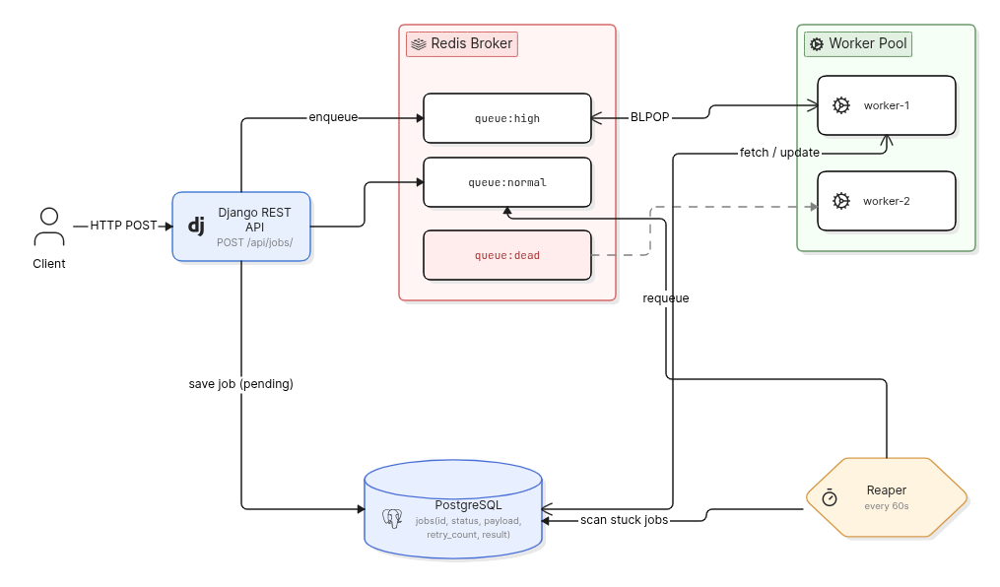

# Task Queue Engine

A production-grade distributed task queue built from scratch using 
Django, Redis, and PostgreSQL — without Celery or any task queue library.

## Architecture



## Features

- **Priority Queues** — High-priority jobs always processed before normal ones
- **Concurrent Workers** — Multiple worker processes with no duplicate job execution
- **Retry with Exponential Backoff** — Failed jobs retry with increasing delays (2s → 4s → 8s)
- **Dead Letter Queue** — Jobs exhausting all retries moved to DLQ for inspection
- **Reaper Process** — Automatically recovers jobs orphaned by worker crashes
- **REST API** — Submit jobs, check status, and monitor queue health

## Tech Stack

- **Backend:** Django, Django REST Framework
- **Queue:** Redis (BLPOP for blocking dequeue, atomic job delivery)
- **Database:** PostgreSQL (job persistence and status tracking)
- **Containerization:** Docker, docker-compose

## Getting Started

### Prerequisites
- Docker and docker-compose installed

### Run the full system

```bash
git clone https://github.com/yourusername/task-queue-engine
cd task-queue-engine
cp .env.example .env        # Fill in your values
docker-compose up --build
docker-compose exec api python manage.py migrate
```

The following services start automatically:
- Django API on `http://localhost:8000`
- 2 concurrent worker processes
- Reaper process (scans every 60 seconds)
- PostgreSQL and Redis

## API Reference

### Submit a Job
```
POST /api/jobs/
```
```json
{
    "task_type": "send_email",
    "payload": {"to": "user@example.com", "subject": "Hello"},
    "priority": "high"
}
```

### Check Job Status
```
GET /api/jobs/{id}/
```

### System Stats
```
GET /api/stats/
```
- Returns job counts by status and Redis queue lengths.

## Supported Task Types

| Task | Description |
|------|-------------|
| `send_email` | Simulates sending an email via SMTP |
| `generate_report` | Simulates heavy report generation |

## Design Decisions

**Why Redis for the queue instead of a DB table?**  
Redis BLPOP is atomic and blocking - workers wait efficiently without 
polling, and two workers can never dequeue the same job.

**Why build without Celery?**  
Building from scratch gave full control over retry logic, priority 
handling, and failure recovery. It also demonstrates understanding of 
what tools like Celery do under the hood.

**At-least-once delivery**  
This system guarantees a job runs at least once. Under worker crash 
scenarios, a job may execute twice. Tasks are designed to be idempotent 
to handle this safely.

## Failure Handling

| Scenario | Behavior |
|----------|----------|
| Task raises exception | Retry with exponential backoff |
| Max retries exceeded | Moved to dead letter queue |
| Worker crashes mid-job | Reaper detects and requeues after 10 min |
| Unknown task type | Immediately marked failed, no retry |

## Known Limitations

**Idempotency:** Current task handlers (`send_email`, `generate_report`) 
are not idempotent - if a worker crashes after completing a task but 
before saving status=done, the reaper may requeue it, causing duplicate 
execution. In production, this would be solved by:
- Using a unique idempotency key per job, checked before execution
- Or making the operation itself idempotent (e.g., "set user status to X" 
  instead of "increment counter by 1")

This is a known tradeoff of at-least-once delivery systems.